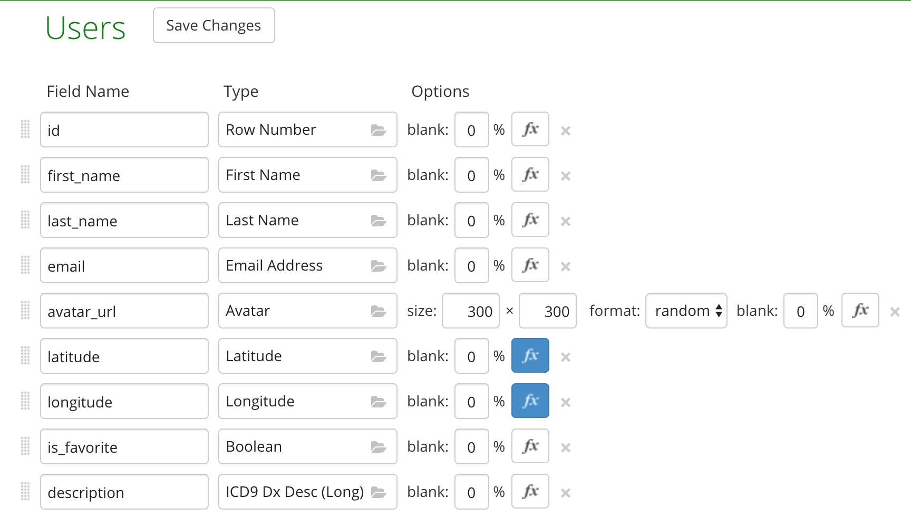

# DemoSwiftUI-Combine

This is an example project of [SwiftUI](https://developer.apple.com/xcode/swiftui) and [Combine](https://developer.apple.com/documentation/combine) using free API Mockaroo.

Here is the schemas of our API:

## :clipboard: Requirements
- Swift5
- Xcode11.0 +
- iOS 13.0 +

##  :warning: Mockaroo API Rate Limiting
Mockaroo API has a limit you can sign up for a free account to start creating your own mock API. Send up to 1000 requests per day.

